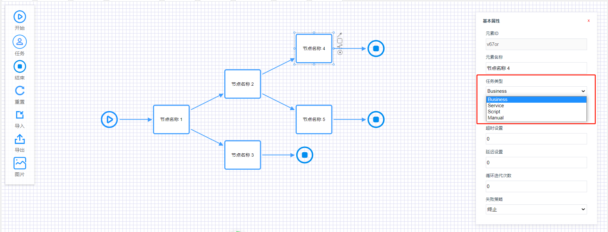

# wast-flow 介绍

轻量级java流程引擎，能轻松实现业务流程编排；<br/>

流程只负责驱动流转，和真实业务解耦。<br/>

支持流程热加载。<br/>

流程图数据结构由传统的xml(比如bpmn)改为JSON。

## Maven

```xml

<dependency>
    <groupId>io.github.wycst</groupId>
    <artifactId>wast-flow</artifactId>
    <version>0.0.1</version>
</dependency>
```

## 使用方法

### 构造引擎实例

```
 FlowEngine flowEngine = new FlowEngine();
```
平平无奇的一行代码，不管是在Spring或者非Spring的其他框架里面都很容易集成。

注：FlowEngine为流程引擎的核心类，为方便使用包含了所有的api，后续也不会刻意拓展。
此实例最好的使用姿势是单例。

### 设置数据源
```
 flowEngine.setDatasource(datasource);
```
> 流程引擎不做强制必须设置数据源，但如果要做已经部署流程的持久化或者需要热更新流程的业务逻辑，存储流程运行的底层日志等场景必须设置数据源；<br>
> 设置数据源后表结构会自动创建；

### 设置静态流程目录
```
 flowEngine.setStaticResources("flows");
```
> 如果流程性质比较特俗比如长时间或者永远都不会发生变更的场景下可以放在资源目录中；<br>
> 写测试案例的场景下也可以使用；

### 加载已部署过流程

```
 flowEngine.loadDeployedProcess();
```
> 加载持久化到数据库中的部署表信息；<br>
> 加载静态流程目录；<br>

### 内存部署

有时候就单纯想部署一个流程到内存中，然后运行，可以使用FlowHelper的一些api,flowEngine部署底层还是使用的FlowHelper。
```
String flowJson = ...;
String processId = "hello";
FlowHelper.deployment(processId, FlowResource.ofJson(flowJson))
```

### 业务如何集成
```
flowEngine.registerHandler(Node.Type.Business, new NodeHandler() {
    @Override
    public void handle(NodeContext nodeContext) throws Exception {
    }
});
```

> 业务需要自己定义一个handler类实现NodeHandler，流程被驱动后从NodeContext可以拿到流程图中配置的所有环节信息进行业务处理；<br>
> 如果流程中有多种节点类型，可以定义多个NodeHandler进行注册；
> Node.Type.Business是个枚举类型，与流程前端设计器中的节点类型保持一致（流程前端设计器后面会说）

### 流程启动
```
Map<String, Object> vars = new HashMap<String, Object>();
vars.put("num", 111);
vars.put("a", 8);

String processId = "hello";
flowEngine.startProcess(processId, vars);
```

### 前端设计器

源码在front目录下，代码使用原生javascript编写可以在所有主流框架中集成使用。
可以直接运行查看效果(vue3外壳)
```
yarn install 
yarn dev
```

html引入方式
```
<div id="app"></div>
<script src="wastflow.umd.js"></script>
<script type="text/javascript">
   var flow = __wf.render("#app", {
      grid: true,
      width: "2000px",
      height: "1000px",
      menu: {
        draggable: true
      },
      // background: "lightblue",
      panable: true
    })

</script>
```

npm安装方式（私库）
```
yarn add wastflow (npm install wastflow --save)
```

node项目使用
```
<div id="flow" ref="flow" class="wast-flow" 
    style="width: 100%; height: 680px; overflow: hidden;">
</div>

import wf from "wastflow"
const flow = wf.render("#flow", {
      grid: true,
      width: "2000px",
      height: "1000px",
      menu: {
        draggable: true
      },
      background: "lightblue",
      panable: true
    })
```

实例销毁（流程图设计添加了部分键盘事件是绑定在document上，在实例不用时处理销毁动作）
```
flow.destroy();
```
界面示意图


